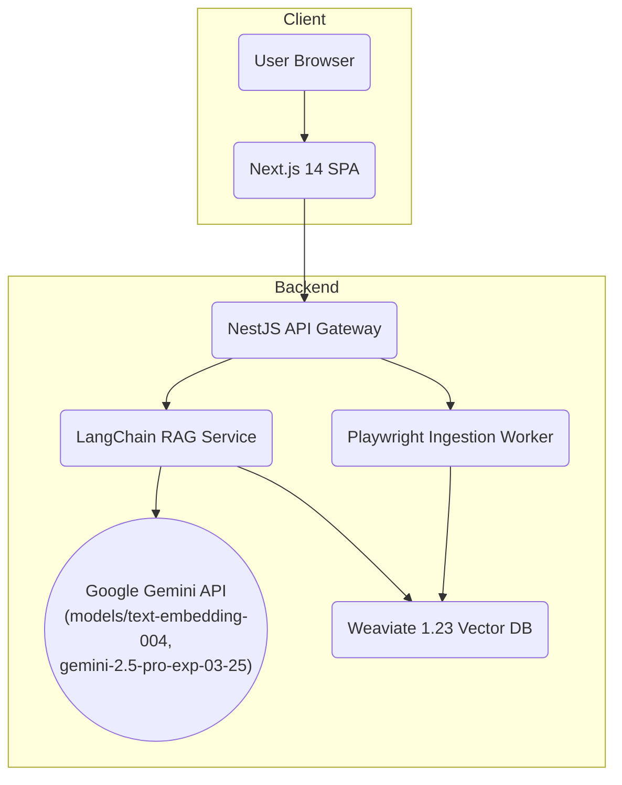

# Technical Specifications - Agentic Malaysia Tax RAG System MVP

## 1. Introduction
This technical specification describes the end‑to‑end MVP RAG system that ingests Malaysian tax webpages/PDFs, stores vector embeddings in **Weaviate** (local Docker instance) and serves Gemini‑powered chat answers with citations using a **Google Gemini API Key**. It implements all functional and non‑functional requirements in PRD‑TAXRAG‑20250505 and FS‑TAXRAG‑20250506 for a local hackathon demo.

## 2. System Architecture

### ARCH‑001  
*Style*: **Layered monolith** (single NestJS backend) + SSR **Next.js** frontend.  
*Patterns*: Dependency Injection (NestJS), Repository, CQRS‑light command/query separation.



#### Component List
| COMPONENT_ID | Name | Tech | Responsibility |
|--------------|------|------|----------------|
| **COMP‑FE‑001** | Next.js SPA | React 18, Next 14 | UI: /ingest & /chat pages |
| **COMP‑API‑001** | API Layer | NestJS | REST controllers, validation, rate‑limit |
| **COMP‑WORK‑001** | Ingestion Worker | NestJS queue (BullMQ) | Crawl, parse, chunk, embed, upsert |
| **COMP‑RAG‑001** | RAG Service | LangChain TS | Prompt embed, retrieve, Gemini answer |
| **COMP‑LOG‑001** | Logging Stack | Winston → Loki | Structured logs, metrics export |

## 3. Technology Stack

| Layer | Technology | Version / Notes |
|-------|------------|-----------------|
| **Frontend** | React 18, Next.js 14 (App Router) | Tailwind 3, Shadcn/ui |
| **Backend** | Node 20, **NestJS 10** | LangChain TS 0.2 |
| **Queue** | BullMQ 4 (Redis) | concurrency 3 |
| **Crawler / Parser** | Playwright 1.42, `@extractus/article-extractor`, `html-to-text`, `pdf-parse` | Node‑only |
| **Embeddings** | Google Generative AI: `models/text-embedding-004` | 768‑dim cosine, via API Key |
| **LLM** | Google Generative AI: `gemini-2.5-pro-exp-03-25` | Via API Key, streaming support |
| **Vector DB** | Weaviate OSS 1.23 (single node) | external vectorizer none |
| **Logging** | Winston JSON → Grafana Loki | OpenTelemetry traces → Tempo |
| **CI/CD** | GitHub Actions | lint → test → build → deploy |
| **Deployment** | Docker, docker‑compose (local demo) | Focus on local execution for hackathon |

## 4. Key APIs

| API_ID | Route | Method | Auth | Description |
|--------|-------|--------|------|-------------|
| **API‑ING‑001** | `/api/ingest` | POST | none | enqueue ingestion job |
| **API‑CHAT‑001** | `/api/chat` | POST (SSE) | none | stream Gemini answer |
| **API‑DOC‑001** | `/api/docs` | GET | none | list ingested docs |

### Error Envelope
```json
{
  "error_code": "STRING",
  "message": "User‑friendly",
  "details": null
}
```

## 5. Component Logic Highlights

### 5.1 Ingestion Worker COMP‑WORK‑001
1. Pop job from Redis queue.  
2. **If** URL ends `.pdf` → download → `pdf-parse`; **else** → Playwright render → `article-extractor`.  
3. Chunk ~1 k tokens (200 overlap).  
4. Embed chunks via Google Generative AI `models/text-embedding-004` (batch 32, using API Key).  
5. Batch upsert `RawDoc` + `DocChunk` objects to Weaviate.  
6. Mark `IngestJob.status` completed or failed.

### 5.2 Chat Flow COMP‑RAG‑001
1. Validate prompt length 1‑512.  
2. Embed prompt with Google Generative AI `models/text-embedding-004` (using API Key).  
3. Weaviate GraphQL `nearVector` top‑k 8 (distance ≤ 0.3).  
4. Build LangChain RetrievalQA with `ChatGoogleGenerativeAI` (Gemini `gemini-2.5-pro-exp-03-25` model, using API Key).  
5. Stream partial tokens to client via NestJS SSE; include inline citation footnotes.

## 6. Security

| SECURITY_ID | Measure | Notes |
|-------------|---------|-------|
| SEC‑TLS‑001 | HTTPS everywhere | N/A for local demo; If exposing, use reverse proxy like Caddy/NGINX with local certs |
| SEC‑RATELIM‑001 | Rate limit `/api/ingest` 10 req/min IP | Nest rate‑limit guard |
| SEC‑CORS‑001 | CORS allowlist production domain | strict |
| SEC‑DEP‑SCAN | Dependabot alerts in GitHub | automated PRs |

*(Auth/roles out‑of‑scope for MVP as per PRD.)*

## 7. Deployment

| Environment | Stack | Details |
|-------------|-------|---------|
| **dev (local demo)** | `docker-compose.yml` | services: frontend (Next.js), backend (NestJS), weaviate (Docker), redis (Docker). Loki/Grafana optional for local demo. |
| **prod** | (Out of scope for local demo) | Original: Terraform → Cloud Run (backend) + Cloud Storage static hosting (frontend) |

Startup script checks `/v1/schema`; creates classes if missing.

## 8. Testing

| TEST_ID | Level | Tool | Goal |
|---------|-------|------|------|
| TEST‑UNIT‑001 | Unit | Jest | 80 % coverage services/utils |
| TEST‑E2E‑001 | End‑to‑End | Playwright | Ingest + chat happy path |
| TEST‑LOAD‑001 | Load | k6 | sustain 20 chat QPS, p99 < 2 s |

## 9. Logging & Monitoring

* **Logs**: Winston JSON `{ts,level,service,requestId,msg,payload}` → Loki.  
* **Metrics**: OpenTelemetry → Tempo traces; Grafana dashboards.  
* **Alerts**: Grafana alert rules – error_rate > 5 % 5 m, latency p99 > 2 s.

## 10. Document History

| Version | Date | Author | Notes |
|---------|------|--------|-------|
| 1.0.1 | 2025‑05‑07 | Cascade Assistant | Updated for Gemini API Key usage & local demo focus. |

---
*End of Technical Specifications*
